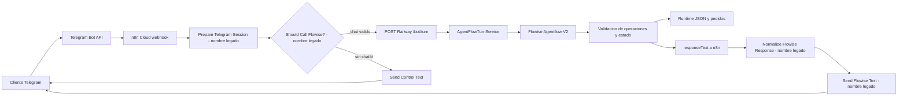

# Arquitectura actual

> **Estado:** Canonico  
> **Ultima verificacion:** 2026-07-17, modo `TURN_DECISION_OWNER=agents` verificado  
> **Fuentes verificadas:** n8n Cloud, Flowise Cloud, Railway health y codigo  
> **Componentes:** Telegram, n8n, backend, Flowise, dashboard y persistencia

## Ruta activa de Telegram

Datos verificados:

- Webhook Telegram: dominio `juancitoooo.app.n8n.cloud`.
- Workflow: `r486AEoUlN6bdpjE`.
- Nombre: `I Love Fresas - Telegram Flowise restaurado`.
- Estado: `Published`.
- HTTP Request publicado:
  `POST https://ilovefresas-backend-dashboard-production.up.railway.app/bot/turn`.
- Header `x-bot-secret`: configurado; valor no documentado.
- Body: `{{ $json.backendPayload }}`.
- `allowed_updates`: `message`.
- Texto, captions, fotos y documentos se transforman al contrato del backend.

Los nombres de tres nodos aun mencionan Flowise, pero ya no describen su funcion
real. El backend decide cuando Flowise participa.

## Responsabilidades por capa

| Capa | Responsabilidad vigente |
| --- | --- |
| Telegram | entrega updates y muestra respuestas/documentos |
| n8n | adaptador sin estado: normaliza input, llama Railway y envia `responseText` |
| Railway backend | transporte, estado durable, catalogo, validacion, cotizacion y pedidos |
| Flowise | rutas, operaciones, preguntas, correcciones y progresion conversacional |
| Runtime JSON | estado operativo para dashboard y conversaciones |
| Dashboard | operacion humana sobre el estado del backend |
| Postgres | ledger de pedidos despachados |

## Estado compartido

Con la conexion publicada, Telegram y el dashboard operan sobre el mismo backend:

| Tema | Fuente de verdad |
| --- | --- |
| Sesion y `/newchat` | conversacion backend en runtime JSON |
| Catalogo | catalogo editable desde dashboard |
| Disponibilidad | `isActive` + `isOutOfStock` del backend |
| Precios | `PricingService` y catalogo persistido |
| Opciones obligatorias | modelo estructurado `requiredOptions` |
| Comprobante | etapa backend + descarga Telegram + OpenAI Vision |
| Orden dashboard | backend crea `pending_review` |
| Contabilidad | Postgres cuando la orden llega a `dispatched` |

Flow State gobierna la ejecucion del turno. Railway rehidrata el estado operativo
en cada llamada porque Flow State no es almacenamiento durable entre predicciones.
El contrato completo esta en [Decisiones conversacionales en Flowise](13-decisiones-conversacionales-flowise.md).

## Archivos y adjuntos

n8n envia al backend:

- `attachmentType` (`image` o `document`);
- `attachmentFileId` del archivo Telegram;
- `mimeType`;
- caption y texto.

El backend usa el token del bot para descargar la media cuando corresponde. El
comprobante solo se evalua si la conversacion espera `comprobante_pago`.

## Dashboard y operario

Las conversaciones que entren por la ruta publicada pueden persistirse y aparecer
en el dashboard. El operario sigue siendo responsable de:

- verificar comprobante e ingreso real del dinero;
- confirmar, preparar y despachar;
- resolver reclamos, tiempos, cobertura, descuentos y excepciones;
- revisar fallos de notificacion o contabilidad.

## Riesgos estructurales vigentes

1. La publicacion fue verificada en n8n, pero falta una regresion manual completa
   posterior al cambio: `/newchat` -> pedido -> comprobante -> dashboard -> despacho.
2. Los nombres de nodos n8n son legados y pueden inducir a error al editar.
3. Flowise Prediction API sigue sin API key propia.
4. n8n estaba en periodo de prueba al verificarlo.
5. No existe idempotencia durable completa para updates y notificaciones.
6. El cliente HTTP de Flowise no tiene timeout/reintentos endurecidos.
7. WhatsApp usa otro controlador y aun no comparte toda la ruta Telegram.
8. El runtime operativo principal sigue siendo un JSON de una sola instancia.
