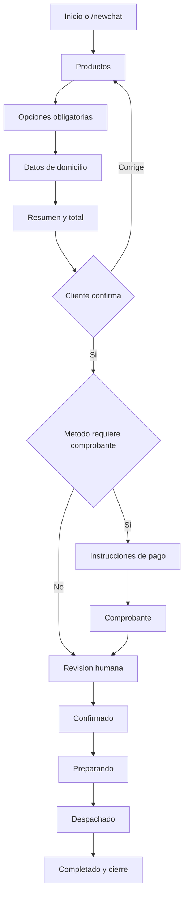

# Recorrido de un pedido

> **Estado:** Canonico; ruta Telegram conectada al backend  
> **Ultima verificacion:** 2026-07-17  
> **Fuentes verificadas:** Agentflow, workflow n8n y servicios backend  
> **Componentes:** conversacion, pedido, pago y operacion

## Recorrido esperado del negocio



## 1. Inicio y `/newchat`

En Telegram, n8n reconoce el update y reenvia `/newchat` como un turno normalizado
a Railway. `AgentFlowTurnService` reinicia la conversacion asociada al `chatId`,
crea una sesion backend limpia y evita que se hereden productos, datos o focos
pendientes. n8n ya no genera ni conserva el `conversationId`.

El backend construye el `sessionId` estable que usa al consultar Flowise. De esta
forma, el reset operativo y la memoria del Agentflow quedan alineados con la misma
conversacion.

## 2. Productos

Flowise enruta al Agente Pedido. El agente reconoce producto, cantidad,
variante, toppings, adiciones y correcciones. Devuelve operaciones cerradas que
el Custom Function valida y aplica. Para productos configurables usa un foco como:

```json
{
  "item_index": 0,
  "unidad_actual": 1,
  "total_unidades": 2,
  "campo_actual": "fruta"
}
```

Railway persiste la representacion estructurada en `OrderDraft.items`,
`selectedOptions` y `components`, y la reinyecta al siguiente turno con IDs estables.

## 3. Opciones obligatorias

El catalogo backend define opciones por producto. Ejemplos actuales:

| Producto | Opciones obligatorias backend |
| --- | --- |
| Waffle Tradicional | fruta, sabor de helado y salsa |
| Waffle Chocolate | fruta, sabor de helado y salsa |
| Vaso Fantasia | sabor de helado, fruta, topping y salsa |
| Fresas con helado | sabor de helado |
| Brownie con Helado | sabor de helado |
| Vaso helado un sabor | un sabor |
| Vaso helado dos sabores | dos sabores |

El backend ya permite omitir un componente removible cuando el cliente lo pide,
por ejemplo `sin helado`. El catalogo dinamico del backend gobierna las opciones
ofrecidas. Flowise conserva algunas listas de respaldo en sus prompts; deben
considerarse una duplicacion pendiente, no la fuente de verdad.

## 4. Datos de domicilio

El draft backend espera normalmente:

- nombre;
- direccion;
- barrio;
- referencia;
- metodo de pago;
- telefono o identificador del canal.

El tipo de entrega predeterminado es `delivery`. `pickup` solo se usa si el
cliente pide recoger. El domicilio se calcula en backend; el valor por defecto
desplegado es `$5,000`.

## 5. Resumen y confirmacion

El resumen seguro debe salir del draft validado e incluir:

- cada producto y configuracion;
- cantidades y adiciones;
- datos de entrega;
- metodo de pago;
- subtotal;
- domicilio;
- descuento si existe;
- total.

Flowise solicita `POST /bot/quote` cuando productos y datos estan completos. El
backend revalida el draft y calcula importes; el Agente Confirmacion solo presenta
la cotizacion validada e interpreta confirmar, corregir o ambiguo.

## 6. Pago y comprobante

El backend consulta la configuracion editable de metodos de pago:

- transferencias activas pueden requerir comprobante;
- efectivo no requiere imagen, pero puede requerir monto para cambio.

El comprobante solo se debe aceptar con `next_expected=comprobante_pago`. El
backend descarga la imagen de Telegram y puede validarla con OpenAI Vision. La
validacion visual indica si parece comprobante; nunca confirma que el dinero
entro.

La integracion publicada envia captions, fotos y documentos al backend mediante
el `file_id` de Telegram. Sigue pendiente una regresion manual completa del flujo
de comprobante despues de esta conexion. Tambien debe endurecerse cualquier
heuristica textual para que una imagen no se acepte sin validacion visual.

## 7. Revision y despacho

Cuando el backend crea la orden, inicia como `pending_review`. El operario puede
trabajar con estos estados:

```text
pending_review -> confirmed -> preparing -> dispatched -> completed
                                  \-> cancelled
```

El codigo actual acepta cualquier estado reconocido desde el endpoint de
dashboard; no obliga tecnicamente a respetar siempre el orden anterior. Esta es
una limitacion pendiente.

Al pasar a `dispatched`:

- se puede notificar al cliente;
- se intenta guardar el pedido en Postgres;
- el dashboard lo muestra en contabilidad.

## 8. Cierre y postventa

Existen estados y servicios para postventa, pero el cierre automatico de
`Necesitas algo mas?` una hora despues no esta verificado como tarea programada
activa en produccion. Debe tratarse como pendiente, no como funcionalidad lista.
