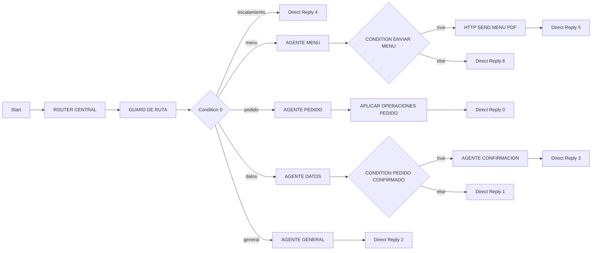

# Flowise Agentflow V2

> **Estado:** Operativo en Cloud  
> **Ultima verificacion:** 2026-07-17, decisiones conversacionales activas  
> **Fuentes verificadas:** interfaz autenticada de Flowise y snapshots locales  
> **Componentes:** Agentflow `e52f27b3-06e2-4fb0-b853-30e936b99839`

## Identificacion

| Campo | Valor |
| --- | --- |
| Plataforma | Flowise Cloud |
| Nombre | `FUTURO TEMPLATE CON IA` |
| ID | `e52f27b3-06e2-4fb0-b853-30e936b99839` |
| Prediction API | `POST /api/v1/prediction/{id}` |
| API key activa | No |
| Override Config | ON |
| Validador de canvas | `Checklist (0)` |

El endpoint es consumido por Railway cuando el backend determina que necesita
interpretacion de Flowise. Railway reporta `hasApiKey=false`; n8n ya no llama la
Prediction API directamente.

Produccion usa `TURN_DECISION_OWNER=agents`: para texto normal Flowise elige la
ruta, propone operaciones y decide la siguiente pregunta. Railway transporta el
turno, rehidrata estado, valida operaciones y ofrece catalogo/cotizacion/orden.
El detalle se mantiene en
[Decisiones conversacionales en Flowise](13-decisiones-conversacionales-flowise.md).

## Topologia verificada



## Start y Flow State

- Input: `Chat Input`.
- Ephemeral Memory: desactivada.
- Persist State: activado.
- Claves declaradas en vivo:

| Clave | Inicial | Clave | Inicial |
| --- | --- | --- | --- |
| `route` | vacio | `confidence` | `0` |
| `reason` | vacio | `mensaje_cliente` | vacio |
| `nombre` | vacio | `direccion` | vacio |
| `barrio` | vacio | `referencia` | vacio |
| `metodo_pago` | vacio | `items` | `[]` |
| `pedido_confirmado` | `false` | `needs_human` | `false` |
| `enviar_menu` | `false` | `phone` | vacio |
| `channel` | vacio | `menu_topic` | vacio |
| `modalidad_entrega` | `domicilio` | `telefono` | vacio |
| `ultima_pregunta_bot` | vacio | `ultimo_agente` | vacio |
| `pedido_en_progreso` | `false` | `configuracion_actual` | vacio |

La migracion usa ademas `stage`, `pending_action`, `target_item_id`,
`target_option_key` y `validated_quote`. Railway los conserva entre llamadas y
los rehidrata mediante las variables habilitadas `conversation_context`,
`order_draft`, `available_catalog`, `current_stage`, `pending_selection` y
`validated_summary`.

No estan declaradas en Start claves usadas por otras capas como subtotal, total,
comprobante, precios faltantes o confirmacion explicita final. El backend maneja
varias de ellas fuera de Flowise.

## Router Central

- Modelo: OpenAI `gpt-5.4-nano`.
- Temperatura: `0`.
- Memoria: desactivada.
- Salida estructurada real:

```json
{
  "route": "general|menu|pedido|datos|escalamiento",
  "confidence": 0.0,
  "reason": "",
  "mensaje_cliente": "",
  "enviar_menu": false,
  "needs_human": false,
  "pedido_confirmado": false
}
```

Actualiza Flow State para todos esos campos excepto `confidence`.

El prompt visible es extenso. Combina taxonomia, estado, prioridades, desempates,
frases concretas y ejemplos de regresion. Tambien exige `state_patch` y
`next_expected`, pero esos campos no existen en el Structured Output del nodo.
Por tanto, la interfaz formal y el contrato escrito no estan completamente
alineados.

## Guard de Ruta

Es una Custom Function sin llamada adicional a un modelo. Recibe `route`,
`needs_human`, `enviar_menu`, `configuracion_actual` y `ultima_pregunta_bot`.

Su prioridad es:

1. conservar `escalamiento` cuando hay humano/riesgo;
2. conservar `menu` cuando se debe enviar el menu completo;
3. forzar `pedido` mientras exista configuracion o una pregunta
   `pedido_opcion:*`/`pedido_wafle_*`;
4. conservar la ruta original en los demas casos.

El Guard no interpreta lenguaje libre ni recuerda conversaciones. Su funcion es
impedir que el Router rompa una etapa ya identificada por estado.

## Condition 0

| Salida | Ruta | Destino |
| --- | --- | --- |
| 0 | `escalamiento` | Direct Reply humano |
| 1 | `menu` | Agente Menu |
| 2 | `pedido` | Agente Pedido |
| 3 | `datos` | Agente Datos |
| 4 | `general` | Agente General |

## Agente Pedido

- Modelo: xAI `grok-3-mini`.
- Memoria: `All Messages`.
- Structured Output activo:

```json
{
  "operations": [],
  "action": "configure_item|ask_more_products|collect_data|clarify|request_quote",
  "target_item_id": null,
  "target_option_key": null,
  "reply": "",
  "needs_human": false
}
```

El agente propone operaciones cerradas. `APLICAR OPERACIONES PEDIDO` valida
productos, opciones y modificadores contra el catalogo dinamico, separa unidades
configurables, actualiza Flow State y genera la pregunta enfocada. No calcula
precios ni escribe directamente una orden.

El contexto llega tanto por Override Config como por bloques
`<available_catalog>` y `<conversation_state>`. El segundo mecanismo evita perder
IDs y foco cuando Flow State comienza vacio en una prediccion nueva.

## Agente Datos

- Modelo: xAI `grok-3-mini-fast`.
- Memoria: `All Messages`.
- Salida: mensaje, nombre, direccion, barrio, referencia, metodo de pago,
  `pedido_confirmado` y `needs_human`.

En este canvas, `pedido_confirmado=true` se usa historicamente como "datos
completos para mostrar resumen". No significa necesariamente que el cliente ya
confirmo el resumen.

## Agente Menu

- Modelo: OpenAI `gpt-5.4-nano`.
- Memoria: `All Messages`.
- Salida: `mensaje_cliente`, `enviar_menu`, `topic`, `needs_human`.

El prompt contiene catalogo y precios estaticos, pero Railway entrega tambien
`catalogo_disponible`. Menu no consume exclusivamente ese valor dinamico; esta
duplicacion debe eliminarse de forma incremental.

## Agente General

- Modelo: OpenAI `gpt-5.4-nano`.
- Memoria: `All Messages`.
- Salida: `mensaje_cliente`, `needs_human`.

Atiende saludos y small talk. El guardrail backend de fuera de alcance se ejecuta
antes de una eventual llamada a este agente en la ruta Telegram publicada.

## Agente Confirmacion

- Modelo: xAI `grok-3-mini-fast`.
- Memoria: `All Messages`.
- Salida: `mensaje_cliente`, `pedido_confirmado_por_cliente`, `needs_human`.

Debe presentar resumen e interpretar confirmacion. El prompt historico depende de
totales/precios que Flow State no garantiza por si mismo.

## Menu PDF dentro del canvas

La rama `HTTP SEND MENU PDF` sigue usando:

- URL placeholder `https://tudashboard.com/api/send-menu`;
- canal fijo `whatsapp`;
- `phone` de Flow State.

No corresponde al PDF real servido por Railway y no es valida para Telegram.

## Direct Replies

| Nodo | Fuente o mensaje |
| --- | --- |
| Direct Reply 0 | respuesta de Pedido |
| Direct Reply 1 | respuesta de Datos |
| Direct Reply 2 | respuesta de General |
| Direct Reply 3 | respuesta de Confirmacion |
| Direct Reply 4 | intervencion humana |
| Direct Reply 5 | texto fijo de menu enviado |
| Direct Reply 6 | `mensaje_cliente` de Menu |

## Lo correcto

- agentes separados por responsabilidad;
- Router seguido de Condition determinista;
- Guard de Ruta basado en estado;
- Structured Outputs activos;
- Flow State persistente por `sessionId`;
- configuracion secuencial de productos complejos.

## Limitaciones verificadas

- Menú y ramas legadas todavía conservan partes historicas del contrato;
- memoria completa puede crecer con conversaciones largas;
- tres modelos/proveedores comparten estado;
- endpoint sin API key;
- HTTP de menu placeholder;
- checklist cero no detecta contradicciones semanticas;
- xAI puede devolver errores temporales de capacidad.

Los prompts completos capturados el 2026-07-16 se conservan en
`flowise/snapshots/2026-07-16/`. La exportacion activa de la migracion esta en
`flowise/exports/agentflow-e52f27b3-2026-07-17-agents-owner.json`.
