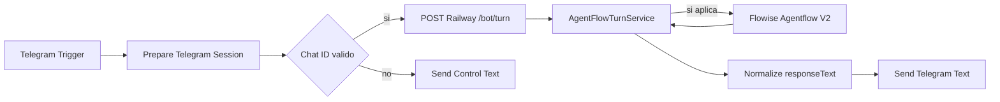

# Canales e integraciones

> **Estado:** Telegram conectado a Railway; WhatsApp preparado pero no productivo  
> **Ultima verificacion:** 2026-07-17, posterior a la publicacion n8n -> Railway  
> **Fuentes verificadas:** Telegram Bot API, n8n Cloud, endpoints Express y configuracion Railway  
> **Componentes:** Telegram, n8n, Railway, Flowise, PDF, WhatsApp y OpenAI

## Telegram activo

El webhook del bot apunta al dominio `juancitoooo.app.n8n.cloud`. n8n recibe el
update y llama el backend desplegado; no llama Flowise directamente.

| Campo | Valor verificado |
| --- | --- |
| Workflow | `I Love Fresas - Telegram Flowise restaurado` |
| ID n8n | `r486AEoUlN6bdpjE` |
| Estado | `Published` |
| Backend | `POST https://ilovefresas-backend-dashboard-production.up.railway.app/bot/turn` |
| Proteccion | header `x-bot-secret`, valor no documentado |
| Body | `{{ $json.backendPayload }}` |

El nombre del workflow y varios nodos conservan la palabra Flowise por razones
historicas. Su funcion vigente es esta:



`Prepare Telegram Session` es tambien un nombre legado. El nodo no conserva una
sesion propia: transforma texto, caption, fotos y documentos al contrato de
`/bot/turn`. Railway decide sesion, `/newchat`, catalogo, precios, disponibilidad,
opciones, resumen, comprobante y pedido.

### Consecuencias

- Cada usuario recibe la respuesta en el mismo `chat.id` que escribio.
- n8n es un adaptador sin estado, no la base de datos del pedido.
- Los cambios de catalogo, disponibilidad, precios y pagos del dashboard llegan
  al chat mediante el backend.
- Flowise solo participa cuando los guardrails backend no resuelven el turno.
- La configuracion fue publicada; falta repetir una conversacion manual completa
  para aceptar el recorrido de punta a punta.

## Webhook directo de Railway

El backend tambien expone `POST /webhook/telegram`, capaz de recibir Telegram sin
n8n. No es el webhook activo porque Telegram admite un solo destino por token. La
ruta vigente conserva n8n para observar ejecuciones y adaptar los updates, pero
ambas alternativas terminan en el mismo servicio conversacional.

## Papel real de n8n

n8n no es obligatorio por capacidad tecnica: Railway puede recibir el webhook.
En la configuracion publicada si es parte del canal porque Telegram le entrega
los updates. Sus responsabilidades quedan limitadas a:

- recibir el update;
- normalizarlo;
- llamar `/bot/turn` con el secreto;
- enviar `responseText` al mismo chat;
- mostrar errores y ejecuciones del adaptador.

n8n no debe guardar conversaciones, catalogos, precios, totales ni decisiones de
pedido. La cuenta estaba en periodo de prueba al verificarla; si deja de estar
activa, el webhook puede migrarse al endpoint directo de Railway.

## Menu PDF

Railway sirve el archivo desde `/bot/menu/pdf` con nombre de descarga
`Menu 2026.pdf`. Al entrar por `/bot/turn`, el backend puede decidir el envio al
mismo chat de Telegram. El nodo `HTTP SEND MENU PDF` del canvas Flowise conserva
una URL placeholder y no debe usarse como fuente de esta operacion.

La integracion tecnica esta conectada, pero el envio del documento debe incluirse
en la regresion manual posterior a esta publicacion.

## Flowise Prediction API

Railway llama cuando corresponde:

```text
POST https://cloud.flowiseai.com/api/v1/prediction/e52f27b3-06e2-4fb0-b853-30e936b99839
```

La llamada no utiliza actualmente una API key de Flowise. Antes de abrir el bot
sin supervision debe protegerse ese endpoint y rotar cualquier credencial que
haya sido expuesta.

## OpenAI y vision

OpenAI se usa en nodos Flowise y en el validador visual del backend. n8n reenvia
el `file_id` de fotos o documentos; Railway descarga la media con el token del bot
y solo intenta validar comprobantes cuando `next_expected=comprobante_pago`.
La vision clasifica apariencia, no confirma el ingreso real del dinero.

## WhatsApp

El backend tiene rutas de verificacion de webhook, recepcion y envio de texto. No
se verificaron credenciales Meta productivas ni un numero conectado. Ademas:

- el controlador no usa exactamente el mismo orquestador que Telegram;
- la descarga de imagenes desde Graph API no esta terminada;
- no hay pruebas sandbox o end-to-end confirmadas;
- no se verifico firma y seguridad productiva completa.

WhatsApp permanece fuera de esta entrega. Cuando se active, debe reutilizar el
mismo estado, catalogo, precios, reglas y creacion de pedidos del backend.
