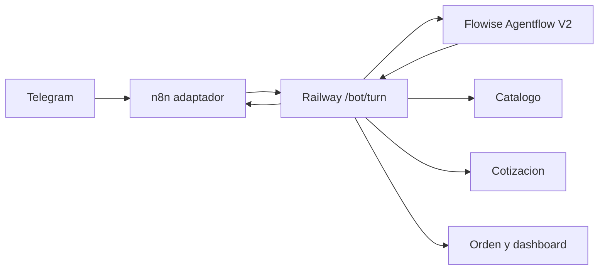

# Decisiones conversacionales en Flowise

> **Estado:** Activo en produccion supervisada  
> **Ultima verificacion:** 2026-07-17  
> **Fuentes verificadas:** Flowise Cloud, Railway production, export versionado y pruebas `/bot/turn`  
> **Componentes:** Agentflow V2, Railway, n8n, Telegram, catalogo, cotizacion y orden

## Objetivo

La migracion mantiene el Agentflow productivo
`e52f27b3-06e2-4fb0-b853-30e936b99839`. Flowise decide la progresion
conversacional y Railway conserva las decisiones operativas deterministas.



## Reparto de responsabilidades

| Flowise | Railway |
| --- | --- |
| interpreta el mensaje | mantiene `sessionId` y `/newchat` |
| elige ruta y especialista | entrega catalogo y contexto estructurado |
| propone operaciones cerradas | valida IDs, opciones y modificadores |
| decide la siguiente pregunta | calcula cotizacion y vencimiento |
| interpreta confirmaciones/correcciones | persiste draft y orden final |
| redacta la respuesta | descarga media y clasifica comprobantes |

Railway no interpreta texto normal en modo `agents`. Si el resultado de Flowise
es inconsistente, Railway aplica invariantes de schema, por ejemplo:
`ask_more_products` siempre permanece en etapa `pedido`.

## Estado entre turnos

Flow State solo existe durante una ejecucion del Agentflow. Para que un segundo
mensaje pueda continuar el primero, Railway rehidrata cada llamada mediante:

- `<conversation_state>` en `question`;
- `conversation_context`;
- `order_draft`;
- `current_stage`;
- `pending_selection`;
- `available_catalog`.

El contexto conserva IDs estables de items. El Custom Function
`APLICAR OPERACIONES PEDIDO` reconstruye `items`, aplica operaciones, encuentra la
primera opcion obligatoria pendiente y actualiza:

```text
stage
pending_action
target_item_id
target_option_key
items
ultima_pregunta_bot
validated_quote
```

## Contrato de Agente Pedido

```json
{
  "operations": [],
  "action": "configure_item|ask_more_products|collect_data|clarify|request_quote",
  "target_item_id": null,
  "target_option_key": null,
  "reply": "",
  "needs_human": false
}
```

Operaciones permitidas:

```text
add_item | remove_item | change_quantity | set_required_option
add_modifier | remove_modifier | correct_item | copy_item_configuration
```

Los productos configurables se separan en unidades `quantity=1`. El estado no
comparte opciones entre unidades salvo una operacion explicita de copia.

## Herramientas Railway

- `GET /bot/catalog/available`: productos disponibles, agotados, toppings,
  adiciones y `requiredOptions`.
- `POST /bot/quote`: revalida disponibilidad, precios y opciones; devuelve un
  `quoteId`, importes y `blockingErrors`.
- `POST /bot/orders/confirmed`: consume una cotizacion valida una sola vez y crea
  la orden `pending_review`.

Los tres contratos sensibles usan `x-bot-secret`. Los valores secretos no se
documentan.

## Activacion y rollback

Variable de Railway:

```text
TURN_DECISION_OWNER=agents
```

Rollback inmediato:

```powershell
railway variables --set "TURN_DECISION_OWNER=legacy"
```

El valor por defecto de `.env.example` permanece `legacy` para que un entorno
nuevo no active la migracion accidentalmente.

## Verificacion productiva

Escenario aceptado el 2026-07-17:

1. `quiero dos waffles tradicionales` creo dos items con IDs distintos.
2. `Fresa fresa arequipe` completo solo el primero.
3. Flowise pidio la fruta del segundo.
4. `banano vainilla nutella` completo solo el segundo.
5. Flowise pregunto si queria agregar otro producto.
6. Estado interno: `stage=pedido`, `pending_action=ask_more_products`.
7. `no` cambio a `stage=datos` y mostro la plantilla completa.

Todas las respuestas tuvieron `source=flowise_agentflow_agents`; no aparecieron
`backend_required_options_guardrail` ni `backend_next_action_guardrail`.

## Riesgos pendientes

- Flowise Prediction API continua sin API key.
- El proveedor xAI puede responder temporalmente por capacidad.
- Falta completar diez conversaciones manuales variadas antes de WhatsApp.
- WhatsApp no forma parte de esta activacion.
